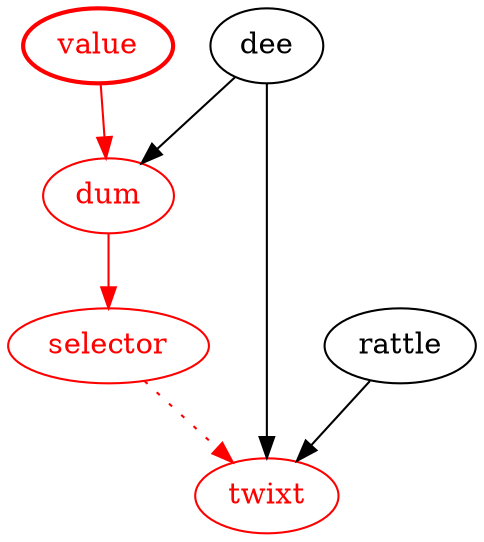
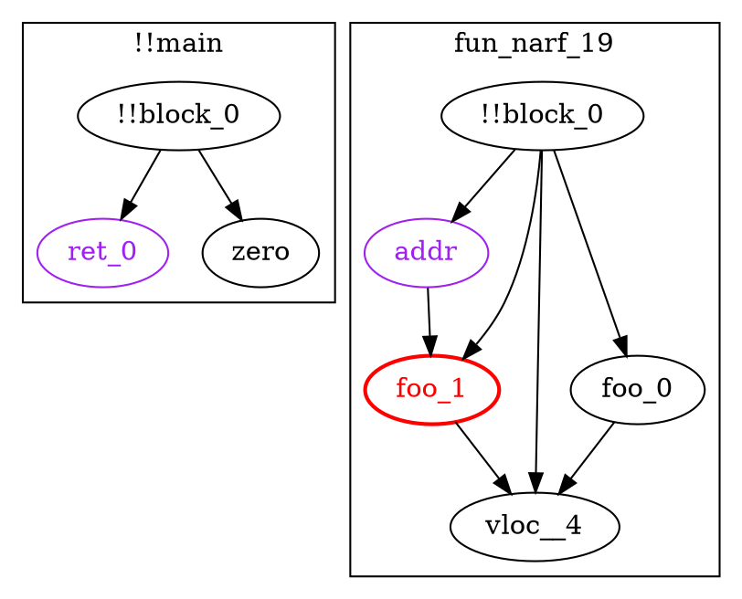
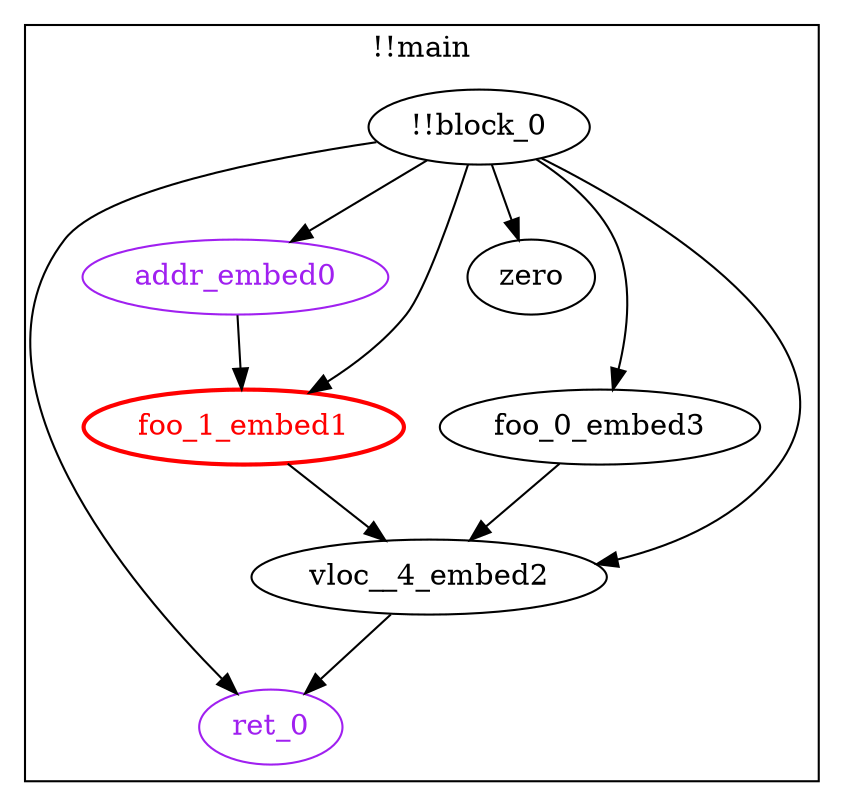
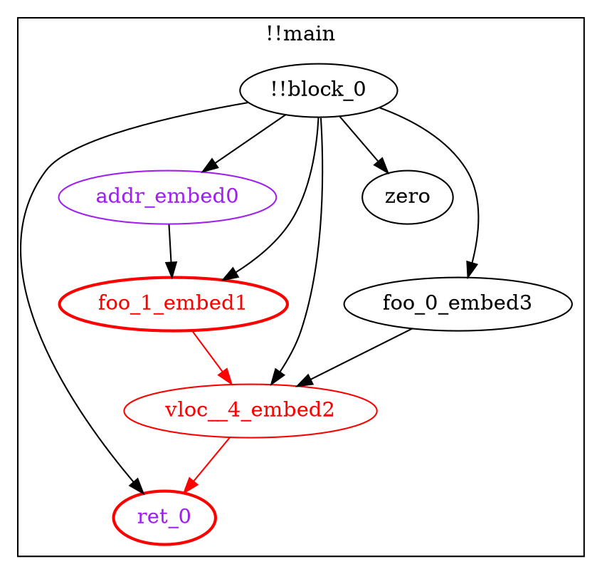

# Automated Detection of Dynamic State Access in Solidity

## Introduction

Continuing the exploration of state provider models described [earlier][sps], we have roughly prototyped a modification to the solidity compiler that can detect instances of dynamic state access (DSA) in smart contracts using taint analysis.

[sps]: https://ethresear.ch/t/state-provider-models-in-ethereum-2-0/6750

## Background

### State Access

 - Why is DSA a problem?
 - Examples of DSA

### Yul Language

Example code in this article is written in pseudocode loosely resembling EVM-flavored [Yul][yul], an internal representation language used in the solidity compiler. The prototype is written as an optimization pass that operates on Yul.

[yul]: https://solidity.readthedocs.io/en/v0.6.3/yul.html

### Taint Analysis

Taint analysis (or [taint checking][taint]) is a type of data flow analysis where "taint" flows from an upstream source into all downstream variables. It is commonly used in web applications, where user supplied values (like headers) are the source of taint, and variables used in database queries are verified to be taint-free.

In a compiled language, it is conceptually similar to symbolic execution, though much less complex.

Consider the following example, where the parameter `value` is tainted:

```yul
function tweedle(value) -> twixt
{
    let dee := 45
    let dum := add(dee, value)
    let rattle := 88
    
    let selector := gt(dum, 100)
    
    switch selector
    case 0 {
        twixt := dee
    }
    default {
        twixt := rattle
    }
}
```

The graph below shows the flow of taint from `value` all the way to `twixt`. Red nodes and edges indicate taint, and dotted lines represent indirect influence (in this case, through the `switch`.)



[taint]: https://en.wikipedia.org/wiki/Taint_checking

## Prototype

### Implementation

Implementation source code is available for [solidity 0.5][solc-5] and for [solidity 0.6][solc-6], though not all features are implemented on both branches. This prototype is built as a Yul optimization pass, and so requires `--optimize-yul --ir` as additional compiler flags.

Since this is a proof of concept, the output is messy and barely readable, the implementation is inefficient, and is 100% capable of summoning [nasal demons][undefined]. Obviously, don't use this software in any kind of production environment.

The analysis can be split into three conceptual phases: data gathering, function resolution, and taint checking.

[solc-5]: https://github.com/SamWilsn/solidity/blob/state-taint-0.5.16/libyul/optimiser/OrderDependentStateDestroyer.cpp
[solc-6]: https://github.com/SamWilsn/solidity/blob/state-taint/libyul/optimiser/OrderDependentStateDestroyer.cpp
[undefined]: https://en.wikipedia.org/wiki/Undefined_behavior

#### Data Gathering

In the data gathering phase, the analyzer visits each node in the Yul abstract syntax tree (AST). This phase accomplishes several goals:

 * Creates a scope for each function;
 * Tracks variable assignments, declarations, and function calls;
 * Tracks return variables and arguments of `sload` and `sstore`;
 * Resolves the effects of built-in functions (ex. `add`, `iszero`);
 * Propagates constant values; and
 * Converts memory accesses into special variables.

The following is a simplified example of the information collected for the given input:

```yul
{
    let zero := 0
    let ret_0 := fun_narf_19()
    sstore(ret_0, zero)

    function fun_narf_19() -> vloc__4
    {
        let addr := 97
        let foo_0 := 54
        let foo_1 := sload(addr)

        vloc__4 := add(foo_0, foo_1)
    }
}
```

The collected output:

```
Known Variables:
    addr         [constant=97] [Untaintable]
    ret_0                      [Untaintable]
    zero         [constant=0]
    vloc__4
    foo_0        [constant=54]
    foo_1                      [Tainted]
    !!block_0    [constant]

Functions:
	!!main() -> 
		Data Flow:
			!!block_0            -> zero, ret_0, 
		Unresolved Function Calls:
			- fun_narf_19

	fun_narf_19() -> vloc__4, 
		Data Flow:
			addr                 -> foo_1,
			foo_1                -> vloc__4, 
			foo_0                -> vloc__4, 
			!!block_0            -> addr, foo_1, foo_0, vloc__4,
```



The variable `!!block_0` is synthesized to represent indirect influence, though there is none in this example. The `!!main` function represents the statements not contained in any other function.

Data flow, in the example output, shows how taint would flow from upstream variables (to the left of `->`) to downstream variables (on the right.)

Note that `fun_narf_19` is listed as an unresolved function call.

#### Function Resolution

The function resolution phase iteratively embeds callee function scopes into the caller's scope, uniquely renaming variables in the data flow graph. Embedding functions in this way allows accurate tracing between arguments and return variables.

Continuing with the above example, the data flow graph after this phase looks like:

```
Functions:
	!!main() -> 
		Data Flow:
			!!block_0            -> zero, ret_0, addr_embed0, foo_1_embed1, foo_0_embed3, vloc__4_embed2
			addr_embed0          -> foo_1_embed1,
			foo_1_embed1         -> vloc__4_embed2,
			foo_0_embed3         -> vloc__4_embed2,
			vloc__4_embed2       -> ret_0
```



#### Taint Checking

Last, and probably simplest, is taint checking. This phase walks through the data flow graph, tainting every variable that is reachable from an initially tainted variable.

Once the taint is propagated, the "protected" variables (variables used as the location argument to an `sload` or `sstore`) are checked for taint. If tainted protected variables are found, a taint violation exception is thrown.

In this example, `ret_0` is both protected and tainted.



### Limitations & Future Work

#### Call Graph Cycles

#### Constant Propagation

#### Calling Contracts

#### Control Flow

#### Bit-Accurate Taint

Variables in the prototype are tracked as an indivisible unit, which may be tainted or clean. Tracking each bit of a variable separately enables more accurate analysis.

This improvement is particularly relevant when using boolean operations (like `or` & `and`) and the `mload` instruction with non-256 bit types.

For example, the following snippet does not exhibit any DSA, though the prototype will report a taint violation:

```yul
function fizzbuzz(value)
{
    // Place a constant byte into memory.
    mstore(0, 0xAB)
    
    // Read a value from storage, place it into memory.
    let from_storage := sload(0)
    mstore(1, from_storage)
    
    // Get the constant back from memory.
    let mem_tainted := mload(0)
    let mem_cleaned := and(mem_tainted, 0xFF)
    
    sstore(mem_cleaned, 0xC0FFEE)
}
```

After execution, the first 33 bytes of memory look like:

```graphviz
digraph structs {
    node [shape=plain];
    struct1 [label=<<table border="0" cellborder="1" cellspacing="0" cellpadding="7"><tr><td>0xAB</td><td><font color="red">??</font></td><td><font color="red">??</font></td><td><font color="red">??</font></td><td><font color="red">??</font></td><td><font color="red">??</font></td><td><font color="red">??</font></td><td><font color="red">??</font></td><td><font color="red">??</font></td><td><font color="red">??</font></td><td><font color="red">??</font></td><td><font color="red">??</font></td><td><font color="red">??</font></td><td><font color="red">??</font></td><td><font color="red">??</font></td><td><font color="red">??</font></td><td><font color="red">??</font></td><td><font color="red">??</font></td><td><font color="red">??</font></td><td><font color="red">??</font></td><td><font color="red">??</font></td><td><font color="red">??</font></td><td><font color="red">??</font></td><td><font color="red">??</font></td><td><font color="red">??</font></td><td><font color="red">??</font></td><td><font color="red">??</font></td><td><font color="red">??</font></td><td><font color="red">??</font></td><td><font color="red">??</font></td><td><font color="red">??</font></td><td><font color="red">??</font></td><td><font color="red">??</font></td></tr></table>>];
}
```



Since `mem_tainted` reads the first 32 bytes of memory, it contains 31 tainted bytes. `mem_cleaned`, on the other hand, contains no tainted bytes, since only the first byte can influence its value.

## Conclusions